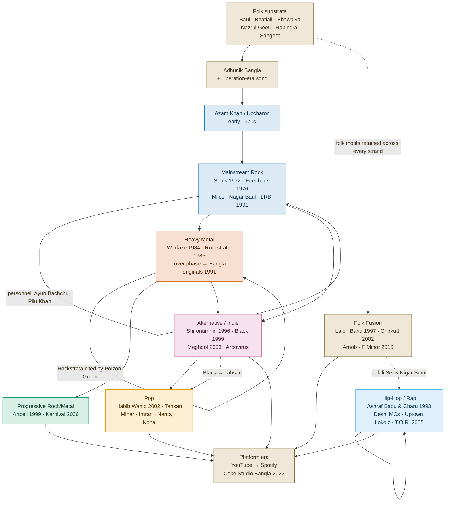

# Genre Evolution Map

A map of how the seven BMEM strands emerged, overlapped and transmitted to each
other, built from the catalogued formation years, documented personnel
movements and stated influence citations. All figures come from
`analysis/outputs/temporal-summary.json` and `influence-analysis.json`; the
lineage edges come from `data/networks/bmpn-multilayer.json`.

**Read this as a map of the catalogue, not of the country.** 63 acts are
catalogued against a target of 300, and the sample over-represents Dhaka
rock and metal. Where the map would mislead if read as a census, it says so.

---

## 1. Strand lifecycles

| Strand | Acts | First | Median | Latest | Span | Still active |
|---|---:|---:|---:|---:|---:|---:|
| Mainstream Rock | 13 | 1972 | 1985 | 2014 | 42 yrs | 92% |
| Heavy Metal | 12 | 1984 | 2001 | 2007 | 23 yrs | 92% |
| Hip-Hop/Rap | 8 | 1993 | 2005 | 2024 | 31 yrs | 100% |
| Alternative/Indie | 16 | 1996 | 2006 | 2018 | 22 yrs | 100% |
| Folk & Folk Fusion | 5 | 1997 | 2001 | 2016 | 19 yrs | 100% |
| Progressive Rock/Metal | 2 | 1999 | 2002 | 2006 | 7 yrs | 100% |
| Pop | 7 | 2002 | 2006 | 2013 | 11 yrs | 100% |

Three things stand out.

**The strands did not arrive in the order the standard narrative gives.**
Hip-hop's first catalogued act (1993) predates alternative/indie (1996), folk
fusion (1997), progressive (1999) and pop (2002). The genre usually described
as the newest arrival is the third-oldest in this catalogue.

**Heavy Metal stopped recruiting.** Its latest catalogued formation is 2007;
alternative/indie kept forming acts until 2018 and hip-hop until 2024. Whether
this is a real closure of the metal strand or an artefact of the catalogue
having been built outward from a well-documented metal core is not settled by
the data. Both readings are live.

**The 2000s produced 26 of 62 dated formations** — more than the 1970s, 1980s
and 1990s combined. That decade is the hinge of the whole map.

## 2. Emergence and transmission

Solid arrows are transmissions with documentary support in the catalogue —
either shared personnel, or one act naming another. Dotted arrows are
continuities asserted in the literature and the project's own notes but not
carried by a structured edge.

## 3. The six documented domestic transmissions

Only six citations in the catalogue name another catalogued Bangladeshi act as
an influence. They are worth listing in full, because they are the entire
observational basis for "internal transmission" in this dataset:

| From | To | What it shows |
|---|---|---|
| Poizon Green | Rockstrata | The founding metal act cited as a direct domestic model — the metal strand acknowledging its own genealogy |
| AvoidRafa | Aurthohin | Fifteen years in one band becoming the vocabulary of the next |
| Conclusion | Owned | Peer-level transmission inside the alternative strand |
| Nova | Feedback | The founding-era rock cohort citing each other |
| Muza | Habib Wahid | Pop lineage: the electronic-pop template passed forward |
| Nova | Azam Khan &amp; Uchcharon | The founding "Pop Guru" cited by the psychedelic-rock cohort that followed him |

Six links across 63 acts is very thin. It reflects how the records were
written — global influences were researched systematically, domestic ones only
where a source happened to state them — more than it reflects how much the
scene borrows internally. Making domestic influence a first-class field in
`data/schemas/artist.schema.json` is the fix, and it is listed in the roadmap.

## 4. Influence vectors by strand

From `analysis/outputs/influence-analysis.json`, the most-cited named global
influence per strand:

| Strand | Top citations |
|---|---|
| Heavy Metal | Metallica (5), Megadeth (4), Iron Maiden (3) |
| Progressive Rock/Metal | Pink Floyd (2), Dream Theater, Opeth, Radiohead, The Beatles |
| Alternative/Indie | Alice in Chains (2), Soundgarden (2), Nirvana, Pearl Jam |
| Mainstream Rock | The Doors (2), Led Zeppelin, Deep Purple, Queen, Clapton, Knopfler |
| Hip-Hop/Rap | Tupac, Biggie, Eminem, Big L (1 each); American hip-hop as a tradition (3) |
| Pop | Karsh Kale (1) and otherwise traditions — contemporary Asian, Indian, South Asian pop |
| Folk & Folk Fusion | **no named acts at all** — jazz, blues, Western rock, world music, as traditions |

Counts are of distinct citing acts. Token kinds are resolved once across the
whole corpus, so an influence cannot rank as a named act in one table and a
tradition in another.

**The naming pattern is itself the finding.** Metal and progressive acts name
specific bands. Pop names exactly one act across seven bands, and folk names
none at all. Two explanations, and this
catalogue cannot separate them: either technical genres transmit through
identifiable models while pop and folk transmit through diffuse convention, or
metal and progressive musicians are simply interviewed about their influences
more often. The second is likely to be at least partly true, since the metal
scene has an academic literature (Quader & Redden 2015; Quader 2016) and the
pop strand does not.

Ten influences are cited across more than one strand. Metallica (6 acts),
Megadeth (5) and Pink Floyd (4) are the scene-wide vectors; Pink Floyd is the
only one reaching three different strands.

## 5. Release-format evolution

From `releases_by_decade`:

| Decade | Studio | EP | Single | Live | Mixed |
|---|---:|---:|---:|---:|---:|
| 1980s | 10 | – | – | – | – |
| 1990s | 18 | – | – | – | 1 |
| 2000s | 40 | 1 | – | 1 | 5 |
| 2010s | 33 | 2 | 3 | – | 1 |
| 2020s | 6 | 1 | 4 | 1 | – |

Singles are absent from the catalogue before the 2010s and are 40% of 2020s
releases. Against a catalogue-wide median gap of 5 years between releases, this
is the album-to-single transition showing up in the discographies themselves.
Two cautions: the 2020s are incomplete, and older singles are simply less likely
to have been catalogued than older albums. The direction is well supported; the
magnitude is not.

## 6. What the map cannot show

- **No sonic measurement.** Every claim about how a strand *sounds* over time
  rests on documented description, not on audio features.
- **Two acts in the progressive strand.** Artcell and Karnival. Any statement
  about "the progressive strand" is a statement about two bands.
- **The 2020s look empty** (1 formation) because recent acts have not yet
  accumulated the documentation this catalogue is built from — not because
  band formation stopped.
